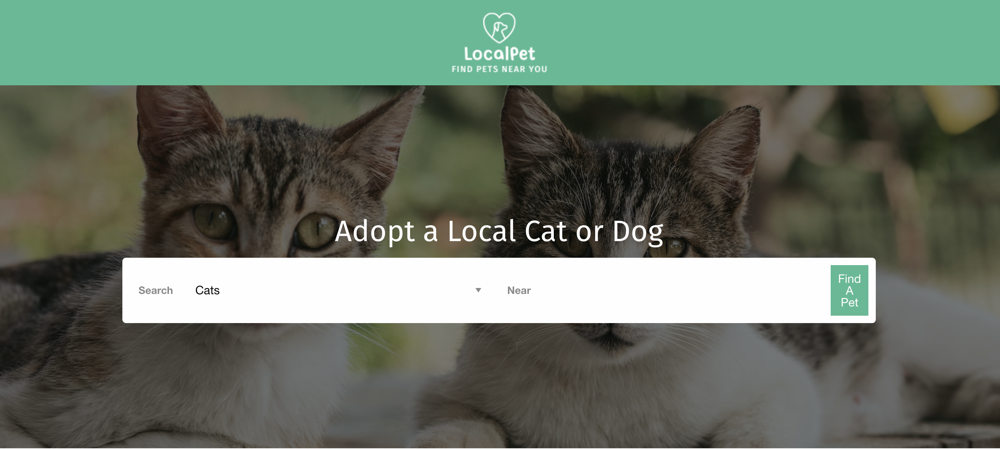
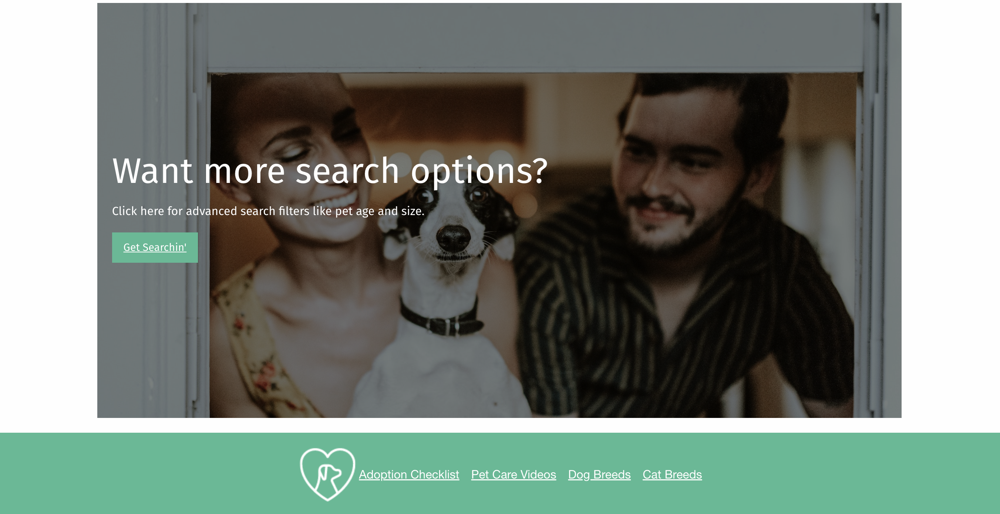
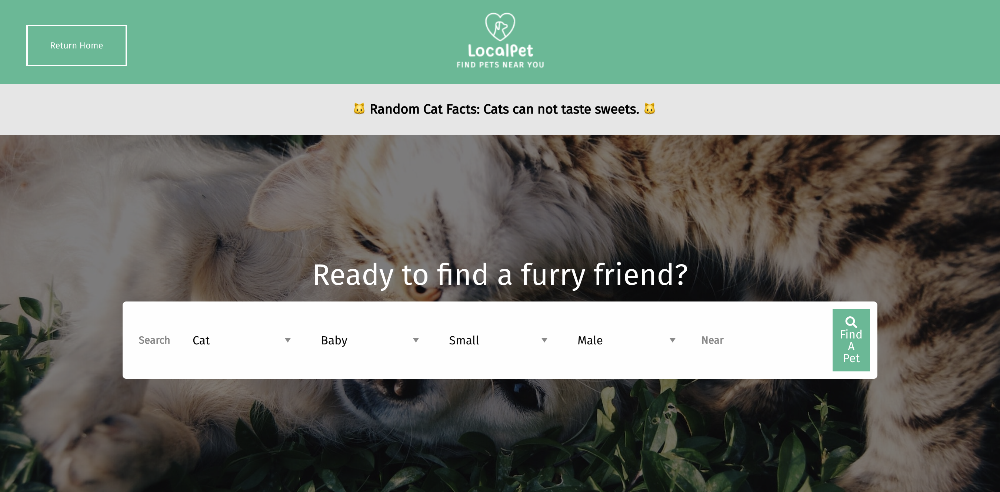
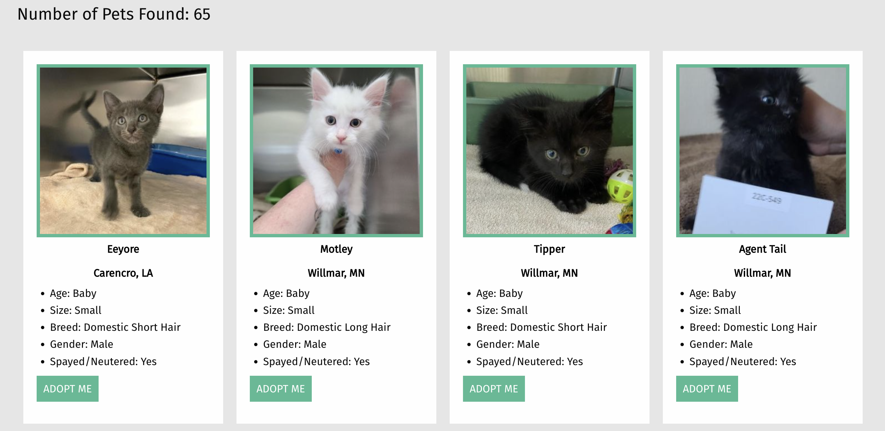

# <Cat-and-Dog-Adoption-Search-Engine>

## Description

This application was created to help a user find local dogs and cats that are available for adoption. By using the Petfinder API and adding in some fun pet facts APIs, we wanted to provide an easy way to search for local adoptable pets. We decided to use Foundation for the CSS framework. Javascript is used to connect the APIs and interactivity across the frontend. 

We learned that it takes a team to complete something like this in a short period of time. We had to work together to get things ironed out between our group and also ensure that this project would be useful/functional. We may be small, but we are mighty!

## Table of Contents

- [Installation](#installation)
- [Usage](#usage)
- [Credits](#credits)
- [License](#license)

## Installation

To install this project, download the files from the repo and right click the index.html file to view it in your browser to see the homepage and begin searching for local adoptable pets.

## Usage

To use this project, simply open up the index.html file and search by selecting between "Cats" and "Dogs" and typing in your city or location. [See home-1] If you'd like to filter down your search even more, you can simply click on the "Get Searchin'" button under the main search bar on the index.html [See home-2].

Once you've started your preliminary search from the homepage or if you have opted to search with more filters on the animal-search.html page, you will see a a random cat fact appear at the top of the page every time you refresh or complete a new search inside of animal-search.html. [See search-1] You'll also have the ability to update your search criteria and filters on this page and last, but not least, be able to see your search results based on the criteria you added in the index.html search or the search from your animal-search.html inputs. [See search-2]

## Credits

Project Collaborators:
Joshua Rhinehart, codeBiskut: [https://github.com/codeBiskut](https://github.com/codeBiskut)
Erin Maxson, erin-maxson: [https://github.com/erin-maxson](https://github.com/erin-maxson)
Sky Stallings, skystalls1122: [https://github.com/skystalls1122](https://github.com/skystalls1122)
Alec Westbrook, alecmichaelw: [https://github.com/alecmichaelw](https://github.com/alecmichaelw)

API Credits:
Petfinder API: [https://www.petfinder.com/developers/](https://www.petfinder.com/developers/)
CatFacts API: cat-facts by alexwohlbruck. [https://github.com/alexwohlbruck/cat-facts](https://github.com/alexwohlbruck/cat-facts), [https://github.com/alexwohlbruck](https://github.com/alexwohlbruck)

Thanks to Brian Baker and Phil Loy for helping us with authenticating the PetFinder API and all of the awesome advice along the way.

## License

MIT License

Copyright (c) [2022] [Joshua Rhinehart, Erin Maxson, Sky Stallings, Alec Westbrook]

Permission is hereby granted, free of charge, to any person obtaining a copy
of this software and associated documentation files (the "Software"), to deal
in the Software without restriction, including without limitation the rights
to use, copy, modify, merge, publish, distribute, sublicense, and/or sell
copies of the Software, and to permit persons to whom the Software is
furnished to do so, subject to the following conditions:

The above copyright notice and this permission notice shall be included in all
copies or substantial portions of the Software.

THE SOFTWARE IS PROVIDED "AS IS", WITHOUT WARRANTY OF ANY KIND, EXPRESS OR
IMPLIED, INCLUDING BUT NOT LIMITED TO THE WARRANTIES OF MERCHANTABILITY,
FITNESS FOR A PARTICULAR PURPOSE AND NONINFRINGEMENT. IN NO EVENT SHALL THE
AUTHORS OR COPYRIGHT HOLDERS BE LIABLE FOR ANY CLAIM, DAMAGES OR OTHER
LIABILITY, WHETHER IN AN ACTION OF CONTRACT, TORT OR OTHERWISE, ARISING FROM,
OUT OF OR IN CONNECTION WITH THE SOFTWARE OR THE USE OR OTHER DEALINGS IN THE
SOFTWARE.

## Badges

## Features

Our project has a search feature that allows the user to search for local cats and dogs that are available for adoption. Once inside the search parameters, a new page will appear. At the top, the user can click on "Get another cat fact" and generate random cat facts back on the page. Inside of each search result for cats and dogs, the user should have enough information to make an educated decision or find further details on the shelter page to learn more about the adoption process.